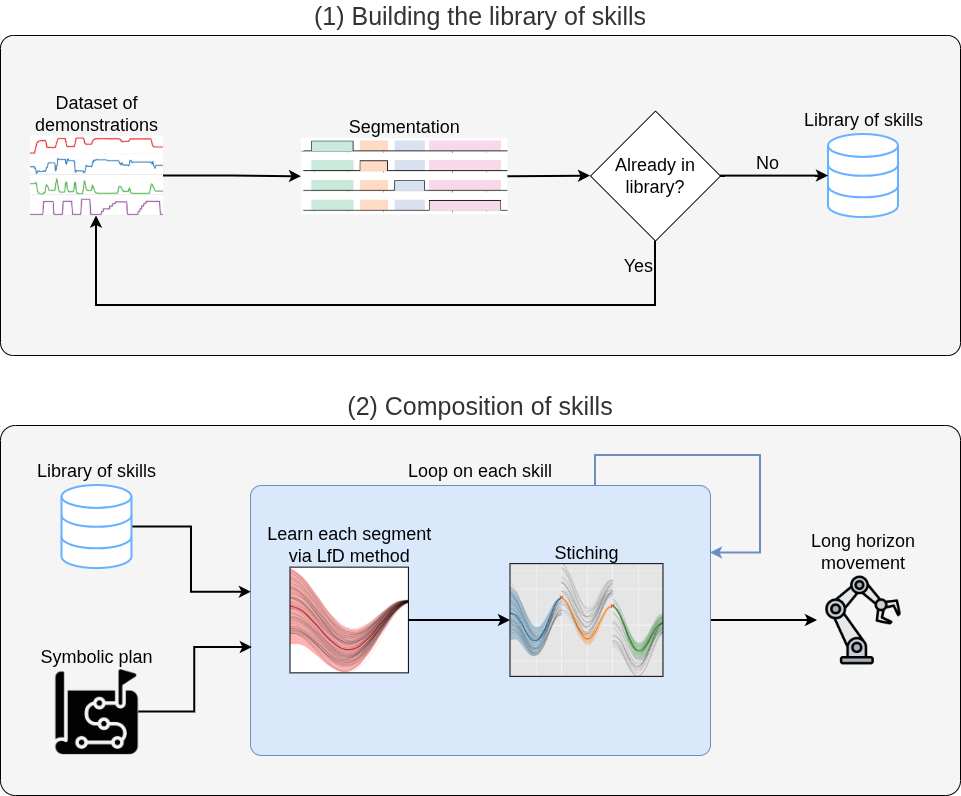

#+title: ToDo
* DONE Data
** DONE Record hand quaternions
https://wiki.ros.org/tf2/Tutorials/Quaternions
* DONE Questions
** Hyperparam search for ruptures?
*** [X] What's the use of a change point detection method if we already have activations functions?
For more general case
** Better to save the raw timeseries or the skills objects?
*** Keep both
** KILL Missing identification of skill?
*** Grounding
** What data types to learn in the LfD?
*** DONE Gripper
*** KILL Orientation
* TODO Code
** KILL Damping of DMP too high
** DONE Resample each segment to the same size
** DONE LfD not learned from the lib!!
*** DONE Learn from several skills if more than one demo
** DONE Plots
*** DONE Transparent background
*** DONE LaTeX font
*** DONE ELMap plot
**** Data in dash line and LfD as solid line (or reverse)
**** Need 2 labels?
** DONE Reproduce long task with skills from different subtasks
** DONE Make CPD work somehow!
** TODO Symbolic plan
*** Verification step to check of pre/post conditions met in the activations/camera
*** Reproduce the long task with different order, e.g. close the drawer at the end
*** Call skills as different e.g. reaching from top & reaching from side
* Next steps
** DONE Schema

*** DONE LfD learning after building library?
*** DONE Loop LfD \to stitch as composition of skills
*** DONE Rename to "Segmentation" only
** DONE Library of skills code
** DONE Get data for new tasks
** DONE Segment new data
*** Input: HDF5 files
*** Outputs: Arrays of segmented primitives
** DONE Learn elastic maps
** DONE Composition/Stitching
Add start & stop constraints
** DONE Export long task + subtasks as CSV
** DONE Finish ground truth segmentation
** Move data to open repository
* DONE Tasks
** Clean in robosuite
** Collect force?
** Rosbag need to collect oriantations/quaternions
*** Set only the final orientation
** Set table only with boiler and cup?
** Simplify subtask
*** Just pour
*** Open/fill/close
** Remove cleaning to discover skill
** Put objects in box/just mark objects
** Use plastic bottle to pour beans
** Drawer subtask to be discovered
** DONE Switch from DMP to elastic map
* Paper
** DONE Start Overleaf draft
** Make clear that the main goal of the paper is skill detection
** Segmentation with moving objects
*** If EEF is moving with no object \to reaching
** Mention alternatives CPD methods
** Section of discovery of new skills
*** Similarity metric \to explain alternatives
** DONE Make diagram for planning alternatives
** DONE Add experiment setup images
* TODO Video
** DONE Show demo and repro in parallel (left & right) running at the same time in the video
** Explain main points with boxes
*** Skills discovered
*** Skills learned
*** KILL Composition/alternative planning
* DONE Similarity/classification
** DONE Normalize before Frechet
** Learn the similarity threshold?
** DONE Add features to the X matrix before checking for similarity
*** Fourier
*** DONE Polynomial
*** Gaussian
** Addition + weighting several metrics?
** DONE More weight to the gripper feature?
And more weight to x/y/z than to velocities or polynomial features
** PCA with all the new features?
** KILL Keep only sign of torsion and curvature?
* DONE Compare with other baselines
** Compare segmentation with HDP-HMM/GP-HSMM
** DONE Compare to Prados et al.
